# Using the app
Learn the notes of 4 frets at a time and learn up to fret 12 for a given string.
Then quiz yourself on all the notes on the string up to the 12th fret.

Practice each day to make it stick in memory :).

# HOW TO USE:
## Let's learn all the notes on the E string up to the 12th fret.
Using this app, you learn 4 notes on each string at a time.
It can be helpful to pick the notes for each group and saying them out loud 3 times in a row.
E.g. frets 1-4 on the E string say "F, F#, G, G#", whilst picking them.

### Learn frets 1-4
#### 1.
On the main menu, tick the E string and the Frets 1-4, Choose "Notes" and press start and answer the question.
Answer all the questions by picking the note it asks, stare at the fretboard and say the note out loud whilst picking it.
I answer each question by saying out loud "E 2 is F sharp".
Repeat this until you get 100% correct.
I seem to need to practice it two to three times.
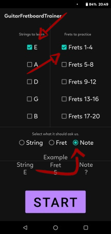 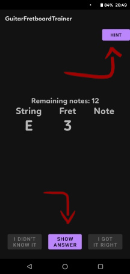

#### 2.
Now go back to the main menu and choose "Frets" and press Start.
To answer, I say out loud "G on E string is 3" whilst staring at the fretboard and picking the note.
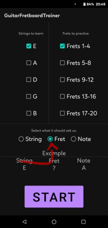 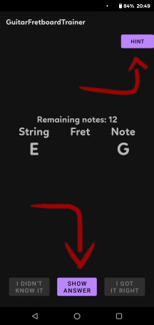
Well done! You've learnt the notes on the first 4 frets.


* * *
### Learn frets 5-8
#### 1.
Repeat the steps above to learn the next 4 frets.
Untick Frets 1-4 and tick Frets 5-8
Choose "Notes"
Answer all the questions.
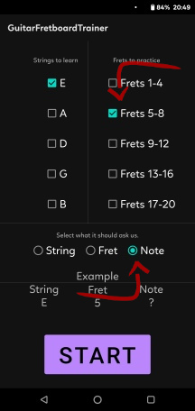 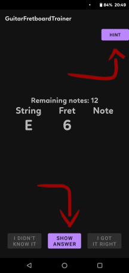

#### 2.
Change to "Frets".
Answer all the questions.
I say out loud "A sharp on E string is 6" whilst staring at the fretboard and picking the note.
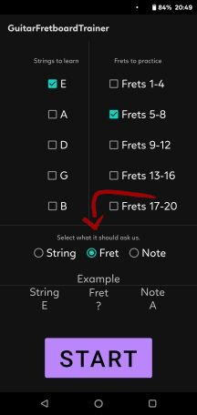 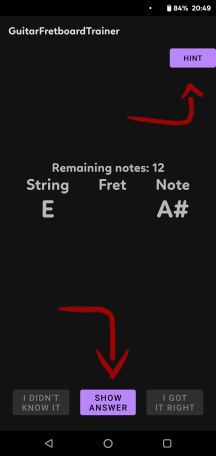


* * *
### Learn frets 9-12
Tick Frets 9-12
#### 1.
Choose "Notes"

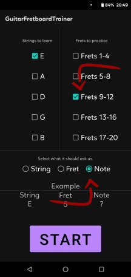 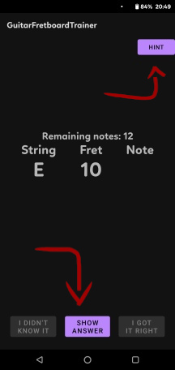

#### 2.
Now go back to the main menu and choose "Frets".

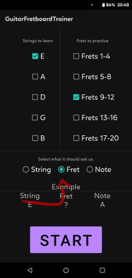 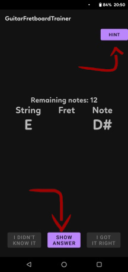

Phew, that was a lot of learning!

* * *
### Master frets 1-12
Tick Frets 1-4, Frets 5-8 and Frets 9-12.
Select Notes.
Answer all the questions.
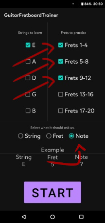 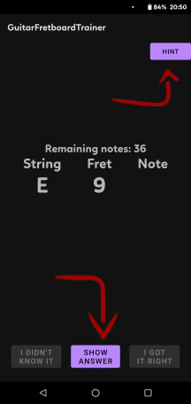

Select Frets
Answer all the questions.
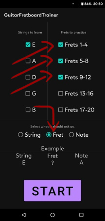 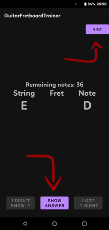

## You've done it! String learnt!
I'm sure you can feel it, that was a lot of practice, so well done!
Keep practising each day to keep it in your memory, it gets easier :).
Once it's starting to stick, you can review each string every few days, then just once a week.

* * *
# Extra hint
Another very useful exercise is to find a note at every location on the fretboard and play it.
Start with the note 'A'.
Once you have that down after a few days, figure out the pattern for 'A#'.
Then  figure out the patter for 'B', and repeat for all notes in the chromatic scale.
```
Play all the 'A' notes on all strings up to the 12th fret
E |----------------------5----------------------|
B |------------------10-----10------------------|
G |---------------2-------------2---------------|
D |------------7-------------------7------------|
A |-----0--12-------------------------12--0-----|
E |--5---------------------------------------5--|
```
This will give you the ability to move around the fretboard a bit easier.
