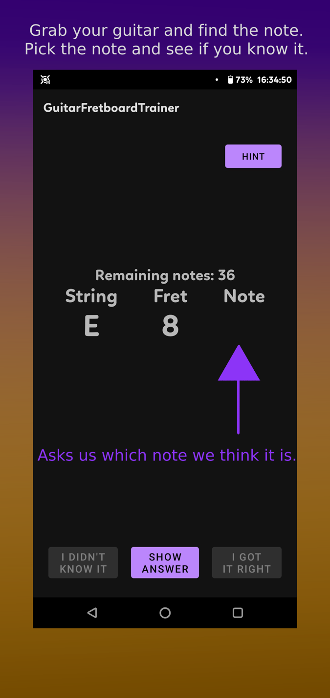

# Guitar Fretboard Trainer

An app to quiz yourself and learn the notes on the guitar fretboard through brute repetition.

Hold your guitar in your hand, pick every note it asks you and see if you know it.

Easy guitar practice :).

# Screenshots
[](fastlane/metadata/android/en-US/images/phoneScreenshots/1.png) [](fastlane/metadata/android/en-US/images/phoneScreenshots/2.png) [](fastlane/metadata/android/en-US/images/phoneScreenshots/3.png) [](fastlane/metadata/android/en-US/images/phoneScreenshots/4.png)

# Credits:
Thanks to Yellow Design Studio for the font used in the f-droid banner Gist Rough found at [fontspace.com](https://www.fontspace.com/gist-rough-upr-exbold-two-demo-font-f19456)

# License
```
GNU version 2
 ```
